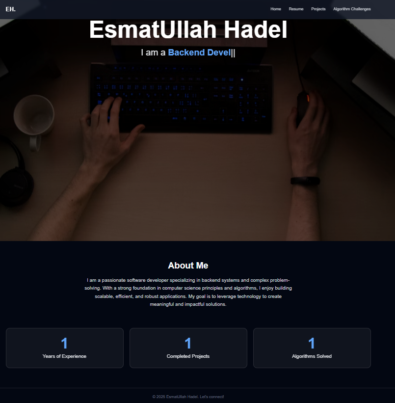

# 🌟 Personal Portfolio Website



## 📌 About The Project
This is my **personal portfolio website** built with **Django**, **Docker**, and **Nginx**.  
It serves as a central hub where visitors can:
- 👨‍💻 Explore my **resume** (view online or download as PDF).  
- 🚀 Browse through my **projects**, check the details, and explore the code.  
- 📚 Discover my **algorithm problem solutions** section, showcasing data structures & algorithm challenges I have solved.  

The portfolio is designed to be **professional, minimalistic, and elegant** while highlighting my skills as a backend engineer.

---

## ⚡ Features
- 📄 **Resume Section** – Online preview and downloadable version of my CV.  
- 💡 **Projects Showcase** – A list of my Django, Python, and other development projects.  
- 🧮 **Algorithms Corner** – A dedicated space for algorithmic problems I have solved (DSA practice).  
- 🌐 **Deployed with Docker & Nginx** for scalability and performance.  

---

## 🛠️ Built With
This project is powered by the following technologies:
- [Django](https://www.djangoproject.com/) – Backend framework  
- [Docker](https://www.docker.com/) – Containerization  
- [Nginx](https://nginx.org/) – Web server & reverse proxy  
- [Bootstrap / Tailwind (optional)] – Frontend styling (if used)  

---
## 📂 Project Structure
    ```bash
    portfolio/
    │── docker-compose.yml
    │── Dockerfile
    │── nginx/
    │   └── nginx.conf
    │── portfolio/
    │   └── ...
    │── home/
    │   └── ...
    │── docker_scripts/
    │   └── ...
    │── .env.example


## 🚀 Getting Started

### Prerequisites
Make sure you have installed:
- Docker 🐳
- Docker Compose

### Installation
1. Clone the repo:
   ```bash
   git clone https://github.com/yourusername/portfolio.git
   cd portfolio
   docker-compose up --build -d

http://localhost   

##📬 Contact

If you want to get in touch with me:

Email: hadelesmatullah@gmail.com

LinkedIn: [Esmatullah Hadel](https://www.linkedin.com/in/esmatullah-hadel-682161279)

GitHub: [social-media-app](https://github.com/Esmat434/social-media-app)